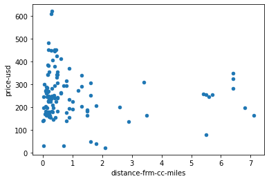

 

## Mini Project 1 – Where do I book an accommodation

This project stems from a very basic requirement that every traveler has to face and we use different

techniques to come up with the best decision that suits our schedule and budget.

## Introduction

A traveler is planning to go Frankfurt, Germany on 5th October, 2022 and he is searching for the best

deal he could get for booking a hotel in the city for one night. In order to solve this we could use

exploratory data analysis techniques to get an overview of how the prices are distributed. But to do that

we first need to get the data from different sources at least three so that it expands our analytical

horizon and gives us the best deals. Then I need to clean the data for further processing and

visualization to make it more interactive I would be implementing a few input controls so that I can

play with the data before recommendation.

## Data Collection

I decided to collect 150 hotels from three different data sources namely:

1. Booking.com

2. Hotels.com

3. Travelocity.com

For analysis reasons I need to fetch and process the data before it reveals any meaningful insights. So I recognized web scraping could be used for data collection and parsing the HTML structure.

## Technical Approach

This project implements web scraper for fetching data using **beautifulSoup** and **selenium**.BeautifulSoap is good with static data parsing but for getting data from dynamic websites like hotels.com and travelocity I needed selenium. Because for dynamic websites data does not appear unless user performs an action. And selenium provides various methods to impersonate a real browser behavior.

## Data Preparation

Though web scraping makes it easy to collect data from vairous sources but the data is in raw so it needs to be treated before it can utilized for EDA. Here are the steps performed in order to clean the
data

-   **Data Re-Scaling**
For the star rating data that I scraped from different data sources were using two different scales that is 5 point and 10 point. So I have to re-scale the data also known as normalization so that values conform to one single scale and can utilized in visualization.

-   **Data Cleanup**
    
    Replace non-integer values or negative values with NaN and non-primitive data types like
    objects to primitive data types, so that the data adheres to single data type and can be plotted on
    graphs.

## Data analysis

For data analysis I decided to stick with four variables that are crucial to decision making

- Price

- Distance from city center

- Review Score

- Star Rating

These also serve as primary features of my data set proving ordinal and numerical variables for my
analysis:

## Scatter Plot

It provides overview of prices and the hotel location in relation to distance from city center Scatter plot between price and distance from center

Note: Some other plots are part of the notebook with complete description. Please refer to note book.

**Conclusion**

Data scraping has its own challenges with static and dynamic DOM structures. So it is important to consider the right parser before data collection phase. Data cleaning is as important as data analysis as I encountered data on two different scales and used linear transformation to get the equivalent.

