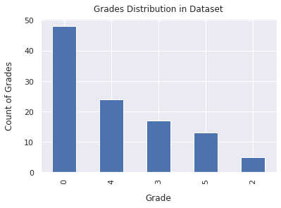
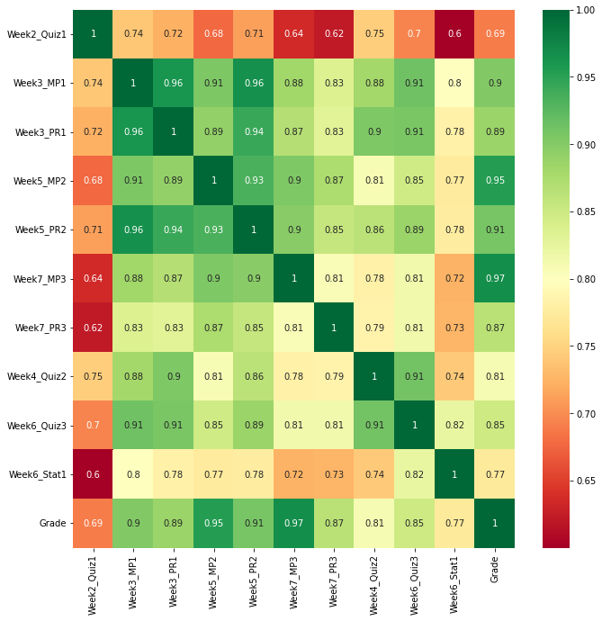
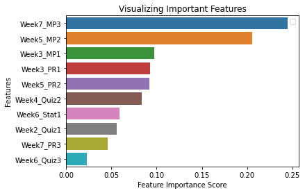
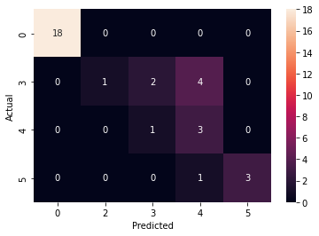
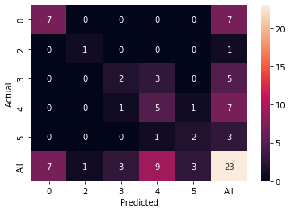

<!DOCTYPE html>
<html lang="en">
    <head>
    <meta charset="UTF-8">
    <meta name="viewport" content="width=device-width, initial-scale=1.0">
        
    </head>
</html>

## Comparative Analysis of Random Forest and KNN Classifiers for Student Grade Prediction Using Machine Learning

### Introduction
Today, predictive analytics applications became an urgent desire in higher educational institutions. Pre-
dictive analytics used advanced analysis techniques that encompass machine learning implementation
to derive high-quality performance and meaningful information for all education levels. It is a well
known fact that student grade is one of the key performance indicators that can help educators monitor
their academic performance.

In order to devise a predictive analysis tool for student grade prediction it is imperative that we draw a
fair comparison between different machine learning models. In this study we are going to consider two
well known classification models namely Random Forest and K-Nearest Neighbours. We will evaluat-
ing their performance over a dataset of 107 students who participated in an online machine learning
course.

The obtained results show that Random Forest performs significantly better than KNN with a precision
score of 0.88 and accuracy of 82%.

### Data Preparation
The data was collected from a fully online nine-week-long course on machine learning, hosted
on the online learning management system Moodle. The dataset contained anonymized information re-
lating to 107 enrolled students. The data included students’ grades (from 3 mini projects, 3 quizzes and
3 peer reviews and the final overall grade) as well as the course logs.

### Descriptive Analysis
The dataset contains student grades for 107 students and it can be seen in Table 1. there are more exam-
ples of Grade 0 than other grades. It also shows that there is mild data imbalance between Grade 0 class
and other classes

<table>
    <caption>Table 1: Distribution of grades among students</caption>
    <thead>
        <tr>
            <th>Grade</th>
            <th>Students</th>
        </tr>
    </thead>
    <tbody>
        <tr>
            <td>0</td>
            <td>48</td>
        </tr>
        <tr>
            <td>4</td>
            <td>24</td>
        </tr>
        <tr>
            <td>3</td>
            <td>17</td>
        </tr>
        <tr>
            <td>5</td>
            <td>13</td>
        </tr>
        <tr>
            <td>2</td>
            <td>5</td>
        </tr>
    </tbody>
</table>

 
 

<figcaption>Grades distribution for machine learning course Figure 1.</figcaption>

 

### Feature Selection
The descriptive analysis showed that we have more examples of ‘Grade 0’ than other grades. And there
is no prior knowledge about how a student could get ‘Grade 1’. We further developed our analytical
base for feature selection using _Pearson correlation coefficient_ to find features that are highly corre-
lated either positively or negatively. In the first phase we evaluated correlation of activity logs repre-
sented by **Week_Stat** columns and Grade. The correlation between activity logs and student grade is
weak in all other cases however there is one feature **Week6_Stat1** among activity logs that has a high
correlation. We consider a relation between two variables strong if their correlation is greater than or
equal to **0.**.

In the second phase we compare correlation between assignments and quizzes that has more weightage
in determining a student grade. The heat map (below) in **figure 2** stands true for the feature selection
and summarize the relationship between highly correlated features and the final grade that a student
could earn.

<figcaption>Heat Map of grade and highly correlated features</figcaption>
<figcaption>Figure 2</figcaption>
 

Following table shows the list of features selected for model training along with their pearson coeffi-
cient and importance scores:

<table>
    <thead>
        <tr>
            <th>Feature</th>
            <th>Pearson Coefficient</th>
            <th>Importance Score</th>
        </tr>
    </thead>
    <tbody>
        <tr>
            <td>Week2_Quiz1</td>
            <td>0.69</td>
            <td>0.06</td>
        </tr>
        <tr>
            <td>Week3_MP1</td>
            <td>0.90</td>
            <td>0.10</td>
        </tr>
        <tr>
            <td>Week3_PR1</td>
            <td>0.89</td>
            <td>0.09</td>
        </tr>
        <tr>
            <td>Week5_MP2</td>
            <td>0.95</td>
            <td>0.21</td>
        </tr>
        <tr>
            <td>Week5_PR2</td>
            <td>0.91</td>
            <td>0.09</td>
        </tr>
        <tr>
            <td>Week7_MP3</td>
            <td>0.97</td>
            <td>0.24</td>
        </tr>
        <tr>
            <td>Week7_PR3</td>
            <td>0.87</td>
            <td>0.05</td>
        </tr>
        <tr>
            <td>Week4_Quiz2</td>
            <td>0.81</td>
            <td>0.08</td>
        </tr>
        <tr>
            <td>Week6_Quiz3</td>
            <td>0.85</td>
            <td>0.02</td>
        </tr>
        <tr>
            <td>Week6_Stat1</td>
            <td>0.77</td>
            <td>0.06</td>
        </tr>
    </tbody>
</table>
 

### Importance Score of features
The importance score was calculated for all the correlated features after the random forest classifier has been fitted to data. This was done to reinforce the feature selection process that highly correlated features are also of high importance and they contribute significantly towards student’s grade. Namely features that describe scores for mini projects like Week3_MP1, Week5_MP2 and Week7_MP3 are the most important features of the given dataset.

Following graph demonstrates features importance score

<figcaption>Importance Score of features</figcaption>
<figcaption>Figure 3</figcaption>
 

### Training & Test Dataset
We splitted the data into training and testing sets. The training set will be used to train the random for-
est classifier, while the testing set will be used to evaluate the model’s performance. We are using 70-
rule that is 70% of the data set is used for training the classifiers (RF and KNN) and 30% of the dataset
is used for evaluating the accuracy of the classifiers.

### Training and Analysis
We trained two different classifiers random forests and K-nearest neighbors. Random Forest (RF) is a
classifier based on ensemble learning that used number of decision trees on multiple subsets to find the best features for high accuracy and prevents the problem of overfitting. We first used _GridSearchCV_ for hyperparameter tuning to calculate the estimators that RF should use for fitting the data. The _Grid-
SearchCV_ suggested _75 estimators_ and we were able to achieve 80% accuracy for student grade prediction. The same approach has been adopted for KNN by first calculating the value of k that is the
number of neighbors that should vote for a given example before it gets labeled. We used _Grid-
SearchCV_ for this purpose and _k=1_ proved a reasonable value as it directly affects model’s accuracy. We were able to achieve 81% accuracy for KNN using k=1 over 70% training data and 30% test data.

### Performance Evaluation
We are using two different perform evaluation tools confusion matrix and classification report. A con-
fusion matrix helps to visualize the classification performance of each predictive model. Figure 1 sum-
marize the results of confusion matrix for model based random forest. We used heat map to present
model accuracy of predicted labels against actual labels.

<figcaption>Figure 4</figcaption>

Figure 2 summarize the results of confusion matrix for KNN based model. We are using heat map to
present model accuracy of predicted labels against against actual labels.

<figcaption>Figure 5</figcaption>

 
In order to draw more vivid comparison between KNN and RF we used classification report evaluation
to highlight the predictive power of both models. We are measuring various metrics including classifi-
cation accuracy, precision, recall and f-score to ensure the predictive model was fit to produce accurate results. Following Table summarizes the prediction performance measures of both classifiers on the student dataset. It can be seen that both models gave similar performance though random forest results are slightly higher than the KNN with a precision of 0.88 and 0.85 respectively.

<table>
    <thead>
        <tr>
            <th>Metric</th>
            <th>KNN</th>
            <th>RF</th>
        </tr>
    </thead>
    <tbody>
        <tr>
            <td>Accuracy</td>
            <td>0.79</td>
            <td>0.82</td>
        </tr>
        <tr>
            <td>Precision</td>
            <td>0.85</td>
            <td>0.88</td>
        </tr>
        <tr>
            <td>Recall</td>
            <td>0.79</td>
            <td>0.82</td>
        </tr>
        <tr>
            <td>F1-Score</td>
            <td>0.79</td>
            <td>0.83</td>
        </tr>
    </tbody>
</table>

### Important Features
Pearson correlation coefficients in Figure 2 and importance scores of individual features in Figure 3
show that the three most important features are **Week3_MP1, Week5_MP2** and **Week7_MP3.**

### Conclusion
Predicting student grades with machine learning depends on the historic data and precise feature selection. In the presence of large number of features it became hard to choose the right set of features for training the model. We recommend applying Pearson correlation to choose highly correlated features and further evaluate them using importance score from a Random Forest Classifier. It is also essential to split the provided dataset into training and test datasets. For performance evaluation and comparative analysis of machine learning based classifiers we recommend using confusion matrix and classification
report.

### Data
To access the data, contact me via email: saadwasem@gmail.com
