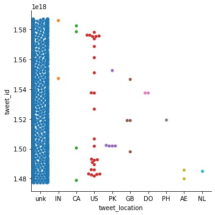
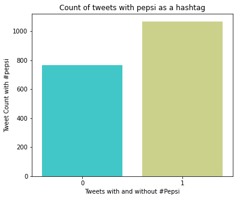
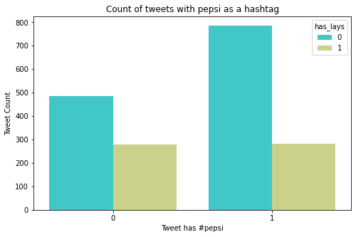
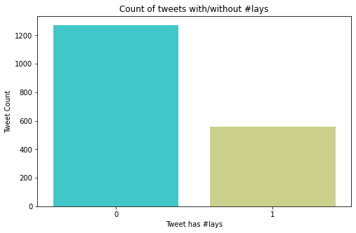
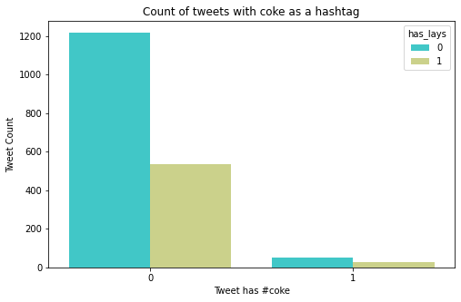
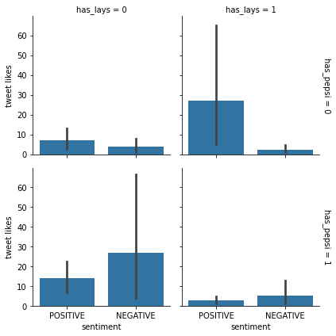
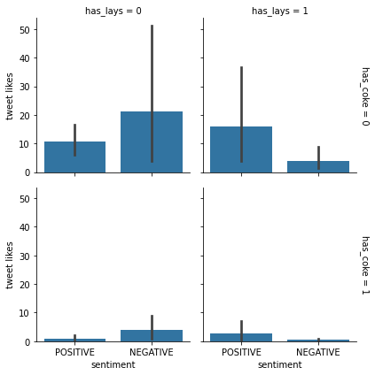
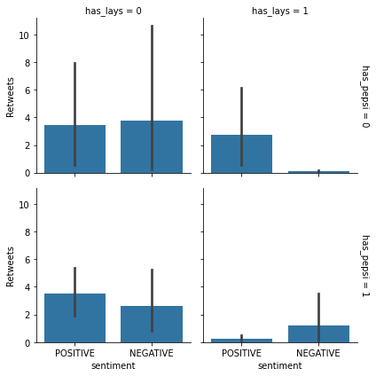
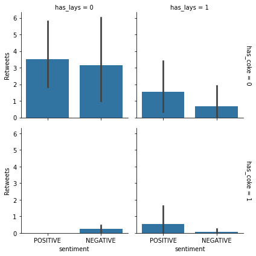

## **Twitter** **Analysis:** **A** **data** **driven** **approach** **towards** **business** **decision** **making**

**Introduction**

An online store is hoping to increase its revenue by combining beverages and snacks. They decided to run an experiment by combining either **#cocacola,** **#Pepsi,** **#lays** at one place. Before doing this
experiment they are interested to perform a data analysis on tweets from these brands and consumers based on hashtags. The results from such an analysis would help them in their decision making for inventory purchase to fulfill incoming orders, design their advertise-ment campaign and increase their store revenue.

**Data** **Collection**

The data has been collected using twitter API with Academic Research level access. The dataset contains 1832 tweets that were posted during past 10 months starting from 1st Jan, 2022 to 1st Oct, 2022. The dataset consists of tweetids, three hashtag attributes that indicate whether a given tweet contains #Pepsi, #coke or #lays either separately or
collectively, tweet likes, retweets, location and a tweet's sentiment (positive or negative).

**Data** **Processing**

The data that has been received from Twitter API version 2 was in JSON format with many missing values and undesired characters. Hence we cleaned the data to perform data analysis that could provide accurate
insights.

**Hashtag** **identification**

We processed raw JSON data to extract required hashtags #coke #Pepsi #lays from a tweet's expansion. Tweet's expansions provide more accurate information about a tweet hashtags. However not all tweets contain
hashtags under expansion object therefore we also considered tweet's text and parsed it to check for relevant keywords and mentions.

**Tweet** **Attributes**

Tweet's likes and retweets are provided by API under tweet's public metrics attribute. In order to get tweet's location we expanded tweet's expansions data to get location information, primarily country code as
they provide statistics on volume of tweets being contributed by a region. Tweet's location information provided by API is limited as most of the tweets do not contain location information that in turn poses a challenge to identify regions of growth.

**Sentiment** **Analysis**

A tweet's sentiment plays a crucial role in terms of user behavior of liking or retweeting a tweet. Therefore we performed sentiment analysis on tweet's text using BERT that is state-of-the-art semantic analysis tool. During this phase of data processing we removed extra characters like emojis from tweet's text to get accurate results.

**Descriptive** **Analysis**

The collected data is distributed across 9 regions and most of the tweets location information is unknown and can only be inferred based on following swarm plot. Tweet Ids are kept to show natural sequence in tweets data if they belong to a particular period that is last ten (10) months for our case. The spread of data shows US leading the content creation for the hashtags under consideration.

  

<em>Figure 1: Tweets distribution across known and unknown regions</em>

However tweet engagement and spread of information equally contributes towards business goals in terms of brand reputation, marketing and sales.

  

<em>Figure 2 - Tweets distribution across known and unknown regions</em>

  

<em>Figure 3 - Likes distribution over sentiment</em>

The data showed that tweets with negative sentiment get more engagement in terms of likes and retweets. This affects the digital identity of a
brand like Pepsi and Coca Cola because the tweets with positive sentiment do not spread fast so if a brand loses reputation on twitter it will take longer to regain that reputation and earn the consumer
confidence as shown in figures 2 and 3.

For this analysis we are considering nearly equal number of positive and negative tweets to draw insights for business decision making as shown
in figure 4.

> **Figure** **4** **--** **Total** **number** **of** **(positive**
> **&** **negative)** **Tweets**

{width="4.474304461942257in"
height="3.772221128608924in"}

In order to obtain reasonable size of tweets data we expanded our
criteria because the tweets data provided by twitter API contained
tweets that does not have required keywords as hashtags but they were
part of tweet text. So to incorporate those tweets we performed text
analysis to recognize Pepsi, Coke, Lays and all possible variations of
these keywords that enabled us to draw more insights from underlying
data. A brief summary of tweets data for each keyword and its variation
is shown in Figure 5, Figure 6 and Figure 7.

> **Figure** **5** **--** **Tweets** **count** **with** **and**
> **without** **#Pepsi**
>
> **Figure** **6** **--** **Tweets** **count** **with** **and**
> **without** **#Coke** **#CocaCola**

{width="5.238888888888889in"
height="3.488888888888889in"}

> **Figure** **7** **--** **Tweets** **count** **with** **and**
> **without** **#Lays**

To draw comparison between combination of hashtags, it is essential to
summarize the volume of tweets that contains #pepsi and #coke and
further compare them with #lays. Figure 8 shows that the study considers
300 tweets that contains both #Pepsi and lays as a hashtag. Similarly
figure 9 shows that we 100 tweets that contains #Coke and #Lays either
as hashtags or in tweet text.

> **Figure** **8** **--** **Tweets** **count** **with** **#pepsi**
> **and** **#lays**

> **Figure** **9** **--** **Tweets** **count** **with** **#coke**
> **and** **#lays**

**Exploratory** **Data** **Analysis**

In order to find the best performing combination of hashtags and
understand user behavior of liking a tweet we used Facet Grid to drew
comparison with all possible combination of hashtags. It can be seen in
figure 10 that tweets associated with #lays are generally taken positive
and earn more likes as compared to #Pepsi. Where as #Pepsi has some sort
of negative sentiment associated with them that affects the tweets likes
when they appear together. This can be seen in fourth graph bottom right
when both tags appear together the negative sentiment for #lays shows
slight growth, positive sentiment is affected badly hence tweet likes
went down. That shows a negative sign of combining these two brands for
marketing and sales objectives.

> **Figure** **10** **--** **Tweet** **likes** **with** **#pepsi**
> **and** **#lays** **all** **combinations**

Similarly, figure 11 explains user behavior of liking a tweet based on
the #coke and #lays and the tweet\'s sentiment. It can be seen that
tweets associated with #lays are generally taken positive and earn more
likes as compared to #coke. Whereas #coke also has slightly negative
sentiment associated with it. However when both #coke and #lays are
combined they perform really better in terms of sentiment we can see a
decrease in negative sentiment for #lays and an increase in positive
sentiment for #coke. That makes them a potential combination that can
perform better when placed together in terms of marketing and sales.

> **Figure** **11** **--** **Tweet** **likes** **with** **#coke**
> **and** **#lays** **all** **combinations**

We performed the same Facet Grid approach for the retweets analysis for
these hashtags and results started to support this developing notion
that #coke and #lays can perform better. This behavior is summarized in
figure 12 and figure 13.

The plot in Figure 11 confirms when #pepsi and #lays appear together the
negative sentiment of the tweet increases and the spread of tweets with
negative sentiment is higher than the positive ones that affects the
brand reputation. Hence combining these two tags show negative results
and does not support in marketing and sales targets.

> **Figure** **11** **--** **Retweets** **with** **#pepsi** **and**
> **#lays** **all** **combinations**

Figure 12 summarizes user behavior of retweeting a tweet based on the
#coke its variant and #lays and the tweet\'s sentiment. It can be seen
when both hashtags are combined the graph shows growth in positive
sentiment of tweets that leads to more spread of the information.

> **Figure** **12** **--** **Retweets** **with** **#coke** **and**
> **#lays** **all** **combinations**

Hence we conclude based on available dataset that combining #coke and
#lays can reach more audience and positively support marketing and sales
goals.

**Findings**

> **#coke** and **#lays** can perform better and supports sales and
> marketing goals.
>
> When **#pepsi** and **#lays** are combined we observed an increased in
> negative sentiment that does not fit the given scenario.
>
> Tweet sentiment significantly influence user behavior of liking and
> retweeting a tweet
>
> Retweets are more harder to earn than likes

**Conclusion**

Data driven decision making can help business in taking the right moves in terms of business growth. But this heavily depends on the quality of data we could get from business operations. During this twitter analysis it was hard for us to first obtain access to Twitter API with Academic Research so that we can collect enough amount of data for our analysis. The immediate challenge that follows is missing values because not every tweet has all the data that we were hoping to get. As the data becomes ready for further processing then it has to cleaned specially for sentiment analysis in order to understand user behavior particularly tweet likes and retweets. This study performed data analysis on twitter data and summarized the results using Facet Grid to understand bigger picture and recommends best performing combination of hashtags for the given scenario.
